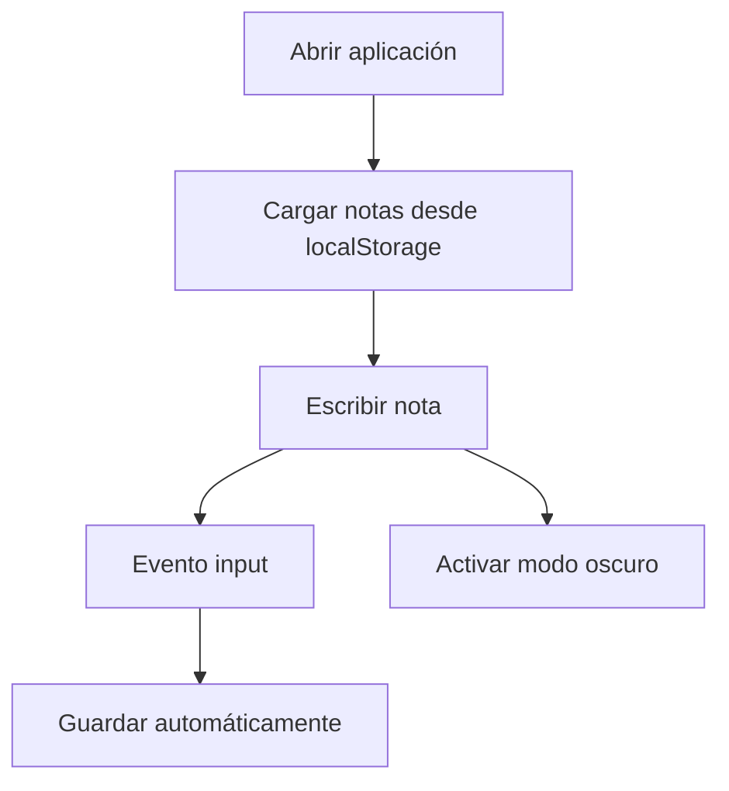

# 📝 Notepad Web

<p align="center">
  
  
  
  
</p>

<p align="center">
  <b>Aplicación web ligera para tomar notas con guardado automático y modo oscuro</b><br>
  Simple · Rápida · Sin frameworks
</p>

---

## 🧭 Descripción

**Notepad Web** es una aplicación web sencilla desarrollada con **HTML, CSS y JavaScript puro** que permite crear y editar notas directamente en el navegador.

Las notas se **guardan automáticamente** usando `localStorage`, lo que garantiza que la información no se pierda al recargar la página. Además, incluye **modo oscuro** para mejorar la experiencia del usuario.

---

## 🎯 Objetivo del proyecto

* Practicar **JavaScript vanilla**
* Trabajar con **DOM y eventos**
* Implementar persistencia con **localStorage**
* Crear una interfaz limpia y usable
* Desarrollar una aplicación sin frameworks

---

## 🧩 Tecnologías usadas

| Tecnología      | Uso                     |
| --------------- | ----------------------- |
| 🧱 HTML5        | Estructura              |
| 🎨 CSS3         | Estilos y modo oscuro   |
| ⚙️ JavaScript   | Lógica de la aplicación |
| 💾 localStorage | Guardado automático     |
| 🌱 Git          | Control de versiones    |
| ☁️ GitHub       | Hosting del repositorio |

---

## 🏗️ Estructura del proyecto

```text
notepad-web
│
├── index.html
├── style.css
├── script.js
├── README.md
└── assets/
```

---

## 🔁 Flujo de funcionamiento



---

## 🧠 Componentes principales

### 📄 index.html

* Estructura base de la aplicación
* Área de texto para escribir notas
* Botón para activar/desactivar modo oscuro

---

### 🎨 style.css

* Estilos principales
* Paleta clara y oscura
* Transiciones suaves

```text
Modo claro ⇄ Modo oscuro
```

---

### ⚙️ script.js

Responsable de:

* Escuchar cambios en el textarea
* Guardar texto en `localStorage`
* Recuperar notas al cargar la página
* Alternar modo oscuro

```text
Usuario escribe → localStorage.setItem()
Página carga → localStorage.getItem()
```

---

## ▶️ Uso de la aplicación

1. Abrir `index.html` en el navegador
2. Escribir una nota
3. El texto se guarda automáticamente
4. Activar modo oscuro si se desea

---

## 🖥️ Ejemplo visual

```text
┌───────────────────────────┐
│        Notepad Web        │
│ ┌───────────────────────┐ │
│ │  Escribe tu nota aquí │ │
│ └───────────────────────┘ │
│ [ 🌙 Dark Mode ]          │
└───────────────────────────┘
```

---

## 🧪 Buenas prácticas aplicadas

* Separación de HTML, CSS y JS
* Código JavaScript claro
* Sin dependencias externas
* Persistencia local eficiente

---

## 🚀 Posibles mejoras futuras

* Múltiples notas
* Exportar notas
* Búsqueda de texto
* Sincronización en la nube

---

## 👤 Autor

Proyecto desarrollado como práctica de **JavaScript y desarrollo web frontend**.

---

<p align="center">
  <span style="color:#0A1F44"><b>HTML · CSS · JavaScript · LocalStorage · GitHub</b></span>
</p>
